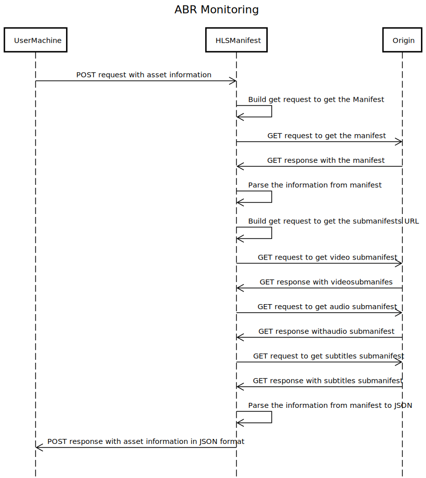

# ABRMonitoring

The idea of this repo and community is to bring common ABR issues (HLS, SS, DASH, CMAF) from different persons and try to get solutions through community background and feed this space as much as posible.

Main tools used here are:
+ Python
+ Djando
+ Docker
+ ElasticSearch
+ Kibana

There are a tons of HLS, Smooth streaming and DASH library to parse the information from manifest to JSON data out there, the idea of this is give the engineer a tool to validate an HTTP Stream asset configuration, check the information that manifest is returning, all the submanifest, audio/video/subtitles chunks, codecs, etc. all of these in a microservice contenirized app responding with REST API, with services able to groth completetly loseless.

Then as you have all of that information, in a phase 2 of the project, the idea is to have another microservice that could use that information of the exposed server and use as input for monitoring, create and elasticsearch cluster and upload it there to give you historical information.

## Workflow

### HLS manifest parse



Diagram designed with: [Sequence Diagram](https://sequencediagram.org/)

# Getting started 
The instructions to install the app in docker are comming here.

## Prerequisites
- Install Docker.
- Install Docker Compose.
- Internet access or CDN/Origin access.

## Instalation

1. Download the repository from this url [ABR Monitoring](https://github.com/GioLopez/ABRMonitoring/)
2. In the same folder as `docker-compose.yml` file, execute the following command:
```sh
docker-compose up -d --build
```

## Usage
The solution was build with an software architecture patern Microservice Deployment, Containerization, Microservice Isolation Levels, that let you use the microservices isolated, in this phase 1 only HLS manifest parser is available and is use as follow:

- HTTP Method: POST
- HTTP Headers: Content-Type:application/json
- URL: in my case: [http://localhost:8001/hlsmanifest/](http://localhost:8001/hlsmanifest/) but that depends where you deployed it
- Body: {"asset_name":"name_of_the_asset.m3u8", "base_url":"http://cdn_fqn:port/path/"}

```sh
curl -XPOST -H'Content-type:application/json' 'http://localhost:8001/hlsmanifest/' -d '{"manifest_url":"https://bitdash-a.akamaihd.net/content/sintel/hls/playlist.m3u8"}'
```

to print pretty formated, add ` | python -m json.tool` at the end of your request, like this:

```sh
curl -XPOST -H'Content-type:application/json' 'http://localhost:8001/hlsmanifest/' -d '{"manifest_url":"https://bitdash-a.akamaihd.net/content/sintel/hls/playlist.m3u8"}' | python -m json.tool
```

<details>

  <summary>Response looks like this!</summary>

```
{
    "asset_info": {
        "audio": {
            "audio_0": {
                "LANGUAGE": "en",
                "NAME": "English",
                "DEFAULT": "YES",
                "AUTOSELECT": "YES",
                "URI": "audio/stereo/en/128kbit.m3u8"
            },
            "audio_1": {
                "LANGUAGE": "dubbing",
                "NAME": "Dubbing",
                "DEFAULT": "NO",
                "NO": "AUTOSELECT",
                "AUTOSELECT": "YES",
                "URI": "audio/stereo/none/128kbit.m3u8"
            },
            "audio_2": {
                "LANGUAGE": "en",
                "NAME": "English",
                "DEFAULT": "YES",
                "AUTOSELECT": "YES",
                "URI": "audio/surround/en/320kbit.m3u8"
            },
            "audio_3": {
                "LANGUAGE": "dubbing",
                "NAME": "Dubbing",
                "DEFAULT": "NO",
                "NO": "AUTOSELECT",
                "AUTOSELECT": "YES",
                "URI": "audio/stereo/none/128kbit.m3u8"
            }
        },
        "video": {
            "video_0": {
                "BANDWIDTH": "258157",
                "CODECS": "avc1.4d400d,mp4a.40.2",
                "AUDIO": "stereo",
                "RESOLUTION": "422x180",
                "SUBTITLES": "subs",
                "URI": "video/250kbit.m3u8"
            },
            "video_1": {
                "BANDWIDTH": "520929",
                "CODECS": "avc1.4d4015,mp4a.40.2",
                "AUDIO": "stereo",
                "RESOLUTION": "638x272",
                "SUBTITLES": "subs",
                "URI": "video/500kbit.m3u8"
            },
            "video_2": {
                "BANDWIDTH": "831270",
                "CODECS": "avc1.4d4015,mp4a.40.2",
                "AUDIO": "stereo",
                "RESOLUTION": "638x272",
                "SUBTITLES": "subs",
                "URI": "video/800kbit.m3u8"
            },
            "video_3": {
                "BANDWIDTH": "1144430",
                "CODECS": "avc1.4d401f,mp4a.40.2",
                "AUDIO": "surround",
                "RESOLUTION": "958x408",
                "SUBTITLES": "subs",
                "URI": "video/1100kbit.m3u8"
            },
            "video_4": {
                "BANDWIDTH": "1558322",
                "CODECS": "avc1.4d401f,mp4a.40.2",
                "AUDIO": "surround",
                "RESOLUTION": "1277x554",
                "SUBTITLES": "subs",
                "URI": "video/1500kbit.m3u8"
            },
            "video_5": {
                "BANDWIDTH": "4149264",
                "CODECS": "avc1.4d4028,mp4a.40.2",
                "AUDIO": "surround",
                "RESOLUTION": "1921x818",
                "SUBTITLES": "subs",
                "URI": "video/4000kbit.m3u8"
            },
            "video_6": {
                "BANDWIDTH": "6214307",
                "CODECS": "avc1.4d4028,mp4a.40.2",
                "AUDIO": "surround",
                "RESOLUTION": "1921x818",
                "SUBTITLES": "subs",
                "URI": "video/6000kbit.m3u8"
            },
            "video_7": {
                "BANDWIDTH": "10285391",
                "CODECS": "avc1.4d4033,mp4a.40.2",
                "AUDIO": "surround",
                "RESOLUTION": "4096x1744",
                "SUBTITLES": "subs",
                "URI": "video/10000kbit.m3u8"
            }
        },
        "subtitles": {
            "subtitles_0": {
                "NAME": "Deutsch",
                "DEFAULT": "NO",
                "NO": "LANGUAGE",
                "AUTOSELECT": "YES",
                "FORCED": "NO",
                "LANGUAGE": "de",
                "URI": "subtitles_de.m3u8"
            },
            "subtitles_1": {
                "NAME": "English",
                "DEFAULT": "YES",
                "AUTOSELECT": "YES",
                "FORCED": "NO",
                "NO": "LANGUAGE",
                "LANGUAGE": "en",
                "URI": "subtitles_en.m3u8"
            },
            "subtitles_2": {
                "NAME": "Espanol",
                "DEFAULT": "NO",
                "NO": "LANGUAGE",
                "AUTOSELECT": "YES",
                "FORCED": "NO",
                "LANGUAGE": "es",
                "URI": "subtitles_es.m3u8"
            },
            "subtitles_3": {
                "NAME": "Français",
                "DEFAULT": "NO",
                "NO": "LANGUAGE",
                "AUTOSELECT": "YES",
                "FORCED": "NO",
                "LANGUAGE": "fr",
                "URI": "subtitles_fr.m3u8"
            }
        }
    },
    "asset_chunks": {
        "audio": {
            "0": "",
            "1": "128kbit/seq-0.ts",
            "2": "128kbit/seq-1.ts",
            "3": "128kbit/seq-2.ts",
            "4": "128kbit/seq-3.ts",
            "5": "128kbit/seq-4.ts",
            "6": "128kbit/seq-5.ts",
            "7": "128kbit/seq-6.ts",
            "8": "128kbit/seq-7.ts",
            "9": "128kbit/seq-8.ts",
            "10": "128kbit/seq-9.ts",
            "11": "128kbit/seq-10.ts",
            "12": "128kbit/seq-11.ts",
            "13": "128kbit/seq-12.ts",
            "14": "128kbit/seq-13.ts",
            "15": "128kbit/seq-14.ts",
            "16": "128kbit/seq-15.ts",
            "17": "128kbit/seq-16.ts",
            "18": "128kbit/seq-17.ts",
            "19": "128kbit/seq-18.ts",
            "20": "128kbit/seq-19.ts",
            "21": "128kbit/seq-20.ts",
            "22": "128kbit/seq-21.ts",
            "23": "128kbit/seq-22.ts",
            "24": "128kbit/seq-23.ts",
            "25": "128kbit/seq-24.ts",
            "26": "128kbit/seq-25.ts",
            "27": "128kbit/seq-26.ts",
            "28": "128kbit/seq-27.ts",
            "29": "128kbit/seq-28.ts",
            "30": "128kbit/seq-29.ts",
            "31": "128kbit/seq-30.ts",
            "32": "128kbit/seq-31.ts",
            "33": "128kbit/seq-32.ts",
            "34": "128kbit/seq-33.ts",
            "35": "128kbit/seq-34.ts",
            "36": "128kbit/seq-35.ts",
            "37": "128kbit/seq-36.ts",
            "38": "128kbit/seq-37.ts",
            "39": "128kbit/seq-38.ts",
            "40": "128kbit/seq-39.ts",
            "41": "128kbit/seq-40.ts",
            "42": "128kbit/seq-41.ts",
            "43": "128kbit/seq-42.ts",
            "44": "128kbit/seq-43.ts",
            "45": "128kbit/seq-44.ts",
            "46": "128kbit/seq-45.ts",
            "47": "128kbit/seq-46.ts",
            "48": "128kbit/seq-47.ts",
            "49": "128kbit/seq-48.ts",
            "50": "128kbit/seq-49.ts",
            "51": "128kbit/seq-50.ts",
            "52": "128kbit/seq-51.ts",
            "53": "128kbit/seq-52.ts",
            "54": "128kbit/seq-53.ts",
            "55": "128kbit/seq-54.ts",
            "56": "128kbit/seq-55.ts",
            "57": "128kbit/seq-56.ts",
            "58": "128kbit/seq-57.ts",
            "59": "128kbit/seq-58.ts",
            "60": "128kbit/seq-59.ts",
            "61": "128kbit/seq-60.ts",
            "62": "128kbit/seq-61.ts",
            "63": "128kbit/seq-62.ts",
            "64": "128kbit/seq-63.ts",
            "65": "128kbit/seq-64.ts",
            "66": "128kbit/seq-65.ts",
            "67": "128kbit/seq-66.ts",
            "68": "128kbit/seq-67.ts",
            "69": "128kbit/seq-68.ts",
            "70": "128kbit/seq-69.ts",
            "71": "128kbit/seq-70.ts",
            "72": "128kbit/seq-71.ts",
            "73": "128kbit/seq-72.ts",
            "74": "128kbit/seq-73.ts",
            "75": "128kbit/seq-74.ts",
            "76": "128kbit/seq-75.ts",
            "77": "128kbit/seq-76.ts",
            "78": "128kbit/seq-77.ts",
            "79": "128kbit/seq-78.ts",
            "80": "128kbit/seq-79.ts",
            "81": "128kbit/seq-80.ts",
            "82": "128kbit/seq-81.ts",
            "83": "128kbit/seq-82.ts",
            "84": "128kbit/seq-83.ts",
            "85": "128kbit/seq-84.ts",
            "86": "128kbit/seq-85.ts",
            "87": "128kbit/seq-86.ts",
            "88": "128kbit/seq-87.ts",
            "89": "128kbit/seq-88.ts",
            "90": "128kbit/seq-89.ts",
            "91": "128kbit/seq-90.ts",
            "92": "128kbit/seq-91.ts",
            "93": "128kbit/seq-92.ts",
            "94": "128kbit/seq-93.ts",
            "95": "128kbit/seq-94.ts",
            "96": "128kbit/seq-95.ts",
            "97": "128kbit/seq-96.ts",
            "98": "128kbit/seq-97.ts",
            "99": "128kbit/seq-98.ts",
            "100": "128kbit/seq-99.ts",
            "101": "128kbit/seq-100.ts",
            "102": "128kbit/seq-101.ts",
            "103": "128kbit/seq-102.ts",
            "104": "128kbit/seq-103.ts",
            "105": "128kbit/seq-104.ts",
            "106": "128kbit/seq-105.ts",
            "107": "128kbit/seq-106.ts",
            "108": "128kbit/seq-107.ts",
            "109": "128kbit/seq-108.ts",
            "110": "128kbit/seq-109.ts",
            "111": "128kbit/seq-110.ts",
            "112": "128kbit/seq-111.ts",
            "113": "128kbit/seq-112.ts",
            "114": "128kbit/seq-113.ts",
            "115": "128kbit/seq-114.ts",
            "116": "128kbit/seq-115.ts",
            "117": "128kbit/seq-116.ts",
            "118": "128kbit/seq-117.ts",
            "119": "128kbit/seq-118.ts",
            "120": "128kbit/seq-119.ts",
            "121": "128kbit/seq-120.ts",
            "122": "128kbit/seq-121.ts",
            "123": "128kbit/seq-122.ts",
            "124": "128kbit/seq-123.ts",
            "125": "128kbit/seq-124.ts",
            "126": "128kbit/seq-125.ts",
            "127": "128kbit/seq-126.ts",
            "128": "128kbit/seq-127.ts",
            "129": "128kbit/seq-128.ts",
            "130": "128kbit/seq-129.ts",
            "131": "128kbit/seq-130.ts",
            "132": "128kbit/seq-131.ts",
            "133": "128kbit/seq-132.ts",
            "134": "128kbit/seq-133.ts",
            "135": "128kbit/seq-134.ts",
            "136": "128kbit/seq-135.ts",
            "137": "128kbit/seq-136.ts",
            "138": "128kbit/seq-137.ts",
            "139": "128kbit/seq-138.ts",
            "140": "128kbit/seq-139.ts",
            "141": "128kbit/seq-140.ts",
            "142": "128kbit/seq-141.ts",
            "143": "128kbit/seq-142.ts",
            "144": "128kbit/seq-143.ts",
            "145": "128kbit/seq-144.ts",
            "146": "128kbit/seq-145.ts",
            "147": "128kbit/seq-146.ts",
            "148": "128kbit/seq-147.ts",
            "149": "128kbit/seq-148.ts",
            "150": "128kbit/seq-149.ts",
            "151": "128kbit/seq-150.ts",
            "152": "128kbit/seq-151.ts",
            "153": "128kbit/seq-152.ts",
            "154": "128kbit/seq-153.ts",
            "155": "128kbit/seq-154.ts",
            "156": "128kbit/seq-155.ts",
            "157": "128kbit/seq-156.ts",
            "158": "128kbit/seq-157.ts",
            "159": "128kbit/seq-158.ts",
            "160": "128kbit/seq-159.ts",
            "161": "128kbit/seq-160.ts",
            "162": "128kbit/seq-161.ts",
            "163": "128kbit/seq-162.ts",
            "164": "128kbit/seq-163.ts",
            "165": "128kbit/seq-164.ts",
            "166": "128kbit/seq-165.ts",
            "167": "128kbit/seq-166.ts",
            "168": "128kbit/seq-167.ts",
            "169": "128kbit/seq-168.ts",
            "170": "128kbit/seq-169.ts",
            "171": "128kbit/seq-170.ts",
            "172": "128kbit/seq-171.ts",
            "173": "128kbit/seq-172.ts",
            "174": "128kbit/seq-173.ts",
            "175": "128kbit/seq-174.ts",
            "176": "128kbit/seq-175.ts",
            "177": "128kbit/seq-176.ts",
            "178": "128kbit/seq-177.ts",
            "179": "128kbit/seq-178.ts",
            "180": "128kbit/seq-179.ts",
            "181": "128kbit/seq-180.ts",
            "182": "128kbit/seq-181.ts",
            "183": "128kbit/seq-182.ts",
            "184": "128kbit/seq-183.ts",
            "185": "128kbit/seq-184.ts",
            "186": "128kbit/seq-185.ts",
            "187": "128kbit/seq-186.ts",
            "188": "128kbit/seq-187.ts",
            "189": "128kbit/seq-188.ts",
            "190": "128kbit/seq-189.ts",
            "191": "128kbit/seq-190.ts",
            "192": "128kbit/seq-191.ts",
            "193": "128kbit/seq-192.ts",
            "194": "128kbit/seq-193.ts",
            "195": "128kbit/seq-194.ts",
            "196": "128kbit/seq-195.ts",
            "197": "128kbit/seq-196.ts",
            "198": "128kbit/seq-197.ts",
            "199": "128kbit/seq-198.ts",
            "200": "128kbit/seq-199.ts",
            "201": "128kbit/seq-200.ts",
            "202": "128kbit/seq-201.ts",
            "203": "128kbit/seq-202.ts",
            "204": "128kbit/seq-203.ts",
            "205": "128kbit/seq-204.ts",
            "206": "128kbit/seq-205.ts",
            "207": "128kbit/seq-206.ts",
            "208": "128kbit/seq-207.ts",
            "209": "128kbit/seq-208.ts",
            "210": "128kbit/seq-209.ts",
            "211": "128kbit/seq-210.ts",
            "212": "128kbit/seq-211.ts",
            "213": "128kbit/seq-212.ts",
            "214": "128kbit/seq-213.ts",
            "215": "128kbit/seq-214.ts",
            "216": "128kbit/seq-215.ts",
            "217": "128kbit/seq-216.ts",
            "218": "128kbit/seq-217.ts",
            "219": "128kbit/seq-218.ts",
            "220": "128kbit/seq-219.ts",
            "221": "128kbit/seq-220.ts",
            "222": "128kbit/seq-221.ts",
            "223": "128kbit/seq-222.ts",
            "224": "128kbit/seq-223.ts",
            "225": "128kbit/seq-224.ts",
            "226": "128kbit/seq-225.ts",
            "227": "128kbit/seq-226.ts",
            "228": "128kbit/seq-227.ts",
            "229": "128kbit/seq-228.ts",
            "230": "128kbit/seq-229.ts",
            "231": "128kbit/seq-230.ts",
            "232": "128kbit/seq-231.ts",
            "233": "128kbit/seq-232.ts",
            "234": "128kbit/seq-233.ts",
            "235": "128kbit/seq-234.ts",
            "236": "128kbit/seq-235.ts",
            "237": "128kbit/seq-236.ts",
            "238": "128kbit/seq-237.ts",
            "239": "128kbit/seq-238.ts",
            "240": "128kbit/seq-239.ts",
            "241": "128kbit/seq-240.ts",
            "242": "128kbit/seq-241.ts",
            "243": "128kbit/seq-242.ts",
            "244": "128kbit/seq-243.ts",
            "245": "128kbit/seq-244.ts",
            "246": "128kbit/seq-245.ts",
            "247": "128kbit/seq-246.ts",
            "248": "128kbit/seq-247.ts",
            "249": "128kbit/seq-248.ts",
            "250": "128kbit/seq-249.ts",
            "251": "128kbit/seq-250.ts",
            "252": "128kbit/seq-251.ts",
            "253": "128kbit/seq-252.ts",
            "254": "128kbit/seq-253.ts",
            "255": "128kbit/seq-254.ts",
            "256": "128kbit/seq-255.ts",
            "257": "128kbit/seq-256.ts",
            "258": "128kbit/seq-257.ts",
            "259": "128kbit/seq-258.ts",
            "260": "128kbit/seq-259.ts",
            "261": "128kbit/seq-260.ts",
            "262": "128kbit/seq-261.ts",
            "263": "128kbit/seq-262.ts",
            "264": "128kbit/seq-263.ts",
            "265": "128kbit/seq-264.ts",
            "266": "128kbit/seq-265.ts",
            "267": "128kbit/seq-266.ts",
            "268": "128kbit/seq-267.ts",
            "269": "128kbit/seq-268.ts",
            "270": "128kbit/seq-269.ts",
            "271": "128kbit/seq-270.ts",
            "272": "128kbit/seq-271.ts",
            "273": "128kbit/seq-272.ts",
            "274": "128kbit/seq-273.ts",
            "275": "128kbit/seq-274.ts",
            "276": "128kbit/seq-275.ts",
            "277": "128kbit/seq-276.ts",
            "278": "128kbit/seq-277.ts",
            "279": "128kbit/seq-278.ts",
            "280": "128kbit/seq-279.ts",
            "281": "128kbit/seq-280.ts",
            "282": "128kbit/seq-281.ts",
            "283": "128kbit/seq-282.ts",
            "284": "128kbit/seq-283.ts",
            "285": "128kbit/seq-284.ts",
            "286": "128kbit/seq-285.ts",
            "287": "128kbit/seq-286.ts",
            "288": "128kbit/seq-287.ts",
            "289": "128kbit/seq-288.ts",
            "290": "128kbit/seq-289.ts",
            "291": "128kbit/seq-290.ts",
            "292": "128kbit/seq-291.ts",
            "293": "128kbit/seq-292.ts",
            "294": "128kbit/seq-293.ts",
            "295": "128kbit/seq-294.ts",
            "296": "128kbit/seq-295.ts",
            "297": "128kbit/seq-296.ts",
            "298": "128kbit/seq-297.ts",
            "299": "128kbit/seq-298.ts",
            "300": "128kbit/seq-299.ts",
            "301": "128kbit/seq-300.ts",
            "302": "128kbit/seq-301.ts",
            "303": "128kbit/seq-302.ts",
            "304": "128kbit/seq-303.ts",
            "305": "128kbit/seq-304.ts",
            "306": "128kbit/seq-305.ts",
            "307": "128kbit/seq-306.ts",
            "308": "128kbit/seq-307.ts",
            "309": "128kbit/seq-308.ts",
            "310": "128kbit/seq-309.ts",
            "311": "128kbit/seq-310.ts",
            "312": "128kbit/seq-311.ts",
            "313": "128kbit/seq-312.ts",
            "314": "128kbit/seq-313.ts",
            "315": "128kbit/seq-314.ts",
            "316": "128kbit/seq-315.ts",
            "317": "128kbit/seq-316.ts",
            "318": "128kbit/seq-317.ts",
            "319": "128kbit/seq-318.ts",
            "320": "128kbit/seq-319.ts",
            "321": "128kbit/seq-320.ts",
            "322": "128kbit/seq-321.ts",
            "323": "128kbit/seq-322.ts",
            "324": "128kbit/seq-323.ts",
            "325": "128kbit/seq-324.ts",
            "326": "128kbit/seq-325.ts",
            "327": "128kbit/seq-326.ts",
            "328": "128kbit/seq-327.ts",
            "329": "128kbit/seq-328.ts",
            "330": "128kbit/seq-329.ts",
            "331": "128kbit/seq-330.ts",
            "332": "128kbit/seq-331.ts",
            "333": "128kbit/seq-332.ts",
            "334": "128kbit/seq-333.ts",
            "335": "128kbit/seq-334.ts",
            "336": "128kbit/seq-335.ts",
            "337": "128kbit/seq-336.ts",
            "338": "128kbit/seq-337.ts",
            "339": "128kbit/seq-338.ts",
            "340": "128kbit/seq-339.ts",
            "341": "128kbit/seq-340.ts",
            "342": "128kbit/seq-341.ts",
            "343": "128kbit/seq-342.ts",
            "344": "128kbit/seq-343.ts",
            "345": "128kbit/seq-344.ts",
            "346": "128kbit/seq-345.ts",
            "347": "128kbit/seq-346.ts",
            "348": "128kbit/seq-347.ts",
            "349": "128kbit/seq-348.ts",
            "350": "128kbit/seq-349.ts",
            "351": "128kbit/seq-350.ts",
            "352": "128kbit/seq-351.ts",
            "353": "128kbit/seq-352.ts",
            "354": "128kbit/seq-353.ts",
            "355": "128kbit/seq-354.ts",
            "356": "128kbit/seq-355.ts",
            "357": "128kbit/seq-356.ts",
            "358": "128kbit/seq-357.ts",
            "359": "128kbit/seq-358.ts",
            "360": "128kbit/seq-359.ts",
            "361": "128kbit/seq-360.ts",
            "362": "128kbit/seq-361.ts",
            "363": "128kbit/seq-362.ts",
            "364": "128kbit/seq-363.ts",
            "365": "128kbit/seq-364.ts",
            "366": "128kbit/seq-365.ts",
            "367": "128kbit/seq-366.ts",
            "368": "128kbit/seq-367.ts",
            "369": "128kbit/seq-368.ts",
            "370": "128kbit/seq-369.ts",
            "371": "128kbit/seq-370.ts",
            "372": "128kbit/seq-371.ts",
            "373": "128kbit/seq-372.ts",
            "374": "128kbit/seq-373.ts",
            "375": "128kbit/seq-374.ts",
            "376": "128kbit/seq-375.ts",
            "377": "128kbit/seq-376.ts",
            "378": "128kbit/seq-377.ts",
            "379": "128kbit/seq-378.ts",
            "380": "128kbit/seq-379.ts",
            "381": "128kbit/seq-380.ts",
            "382": "128kbit/seq-381.ts",
            "383": "128kbit/seq-382.ts",
            "384": "128kbit/seq-383.ts",
            "385": "128kbit/seq-384.ts",
            "386": "128kbit/seq-385.ts",
            "387": "128kbit/seq-386.ts",
            "388": "128kbit/seq-387.ts",
            "389": "128kbit/seq-388.ts",
            "390": "128kbit/seq-389.ts",
            "391": "128kbit/seq-390.ts",
            "392": "128kbit/seq-391.ts",
            "393": "128kbit/seq-392.ts",
            "394": "128kbit/seq-393.ts",
            "395": "128kbit/seq-394.ts",
            "396": "128kbit/seq-395.ts",
            "397": "128kbit/seq-396.ts",
            "398": "128kbit/seq-397.ts",
            "399": "128kbit/seq-398.ts",
            "400": "128kbit/seq-399.ts",
            "401": "128kbit/seq-400.ts",
            "402": "128kbit/seq-401.ts",
            "403": "128kbit/seq-402.ts",
            "404": "128kbit/seq-403.ts",
            "405": "128kbit/seq-404.ts",
            "406": "128kbit/seq-405.ts",
            "407": "128kbit/seq-406.ts",
            "408": "128kbit/seq-407.ts",
            "409": "128kbit/seq-408.ts",
            "410": "128kbit/seq-409.ts",
            "411": "128kbit/seq-410.ts",
            "412": "128kbit/seq-411.ts",
            "413": "128kbit/seq-412.ts",
            "414": "128kbit/seq-413.ts",
            "415": "128kbit/seq-414.ts",
            "416": "128kbit/seq-415.ts",
            "417": "128kbit/seq-416.ts",
            "418": "128kbit/seq-417.ts",
            "419": "128kbit/seq-418.ts",
            "420": "128kbit/seq-419.ts",
            "421": "128kbit/seq-420.ts",
            "422": "128kbit/seq-421.ts",
            "423": "128kbit/seq-422.ts",
            "424": "128kbit/seq-423.ts",
            "425": "128kbit/seq-424.ts",
            "426": "128kbit/seq-425.ts",
            "427": "128kbit/seq-426.ts",
            "428": "128kbit/seq-427.ts",
            "429": "128kbit/seq-428.ts",
            "430": "128kbit/seq-429.ts",
            "431": "128kbit/seq-430.ts",
            "432": "128kbit/seq-431.ts",
            "433": "128kbit/seq-432.ts",
            "434": "128kbit/seq-433.ts",
            "435": "128kbit/seq-434.ts",
            "436": "128kbit/seq-435.ts",
            "437": "128kbit/seq-436.ts",
            "438": "128kbit/seq-437.ts",
            "439": "128kbit/seq-438.ts",
            "440": "128kbit/seq-439.ts",
            "441": "128kbit/seq-440.ts",
            "442": "128kbit/seq-441.ts",
            "443": "128kbit/seq-442.ts",
            "444": "128kbit/seq-443.ts",
            "445": "128kbit/seq-444.ts",
            "446": "128kbit/seq-445.ts",
            "447": "128kbit/seq-446.ts",
            "448": "128kbit/seq-447.ts",
            "449": "128kbit/seq-448.ts",
            "450": "128kbit/seq-449.ts",
            "451": "128kbit/seq-450.ts",
            "452": "128kbit/seq-451.ts",
            "453": "128kbit/seq-452.ts",
            "454": ""
        },
        "video": {
            "0": "",
            "1": "250kbit/seq-0.ts",
            "2": "250kbit/seq-1.ts",
            "3": "250kbit/seq-2.ts",
            "4": "250kbit/seq-3.ts",
            "5": "250kbit/seq-4.ts",
            "6": "250kbit/seq-5.ts",
            "7": "250kbit/seq-6.ts",
            "8": "250kbit/seq-7.ts",
            "9": "250kbit/seq-8.ts",
            "10": "250kbit/seq-9.ts",
            "11": "250kbit/seq-10.ts",
            "12": "250kbit/seq-11.ts",
            "13": "250kbit/seq-12.ts",
            "14": "250kbit/seq-13.ts",
            "15": "250kbit/seq-14.ts",
            "16": "250kbit/seq-15.ts",
            "17": "250kbit/seq-16.ts",
            "18": "250kbit/seq-17.ts",
            "19": "250kbit/seq-18.ts",
            "20": "250kbit/seq-19.ts",
            "21": "250kbit/seq-20.ts",
            "22": "250kbit/seq-21.ts",
            "23": "250kbit/seq-22.ts",
            "24": "250kbit/seq-23.ts",
            "25": "250kbit/seq-24.ts",
            "26": "250kbit/seq-25.ts",
            "27": "250kbit/seq-26.ts",
            "28": "250kbit/seq-27.ts",
            "29": "250kbit/seq-28.ts",
            "30": "250kbit/seq-29.ts",
            "31": "250kbit/seq-30.ts",
            "32": "250kbit/seq-31.ts",
            "33": "250kbit/seq-32.ts",
            "34": "250kbit/seq-33.ts",
            "35": "250kbit/seq-34.ts",
            "36": "250kbit/seq-35.ts",
            "37": "250kbit/seq-36.ts",
            "38": "250kbit/seq-37.ts",
            "39": "250kbit/seq-38.ts",
            "40": "250kbit/seq-39.ts",
            "41": "250kbit/seq-40.ts",
            "42": "250kbit/seq-41.ts",
            "43": "250kbit/seq-42.ts",
            "44": "250kbit/seq-43.ts",
            "45": "250kbit/seq-44.ts",
            "46": "250kbit/seq-45.ts",
            "47": "250kbit/seq-46.ts",
            "48": "250kbit/seq-47.ts",
            "49": "250kbit/seq-48.ts",
            "50": "250kbit/seq-49.ts",
            "51": "250kbit/seq-50.ts",
            "52": "250kbit/seq-51.ts",
            "53": "250kbit/seq-52.ts",
            "54": "250kbit/seq-53.ts",
            "55": "250kbit/seq-54.ts",
            "56": "250kbit/seq-55.ts",
            "57": "250kbit/seq-56.ts",
            "58": "250kbit/seq-57.ts",
            "59": "250kbit/seq-58.ts",
            "60": "250kbit/seq-59.ts",
            "61": "250kbit/seq-60.ts",
            "62": "250kbit/seq-61.ts",
            "63": "250kbit/seq-62.ts",
            "64": "250kbit/seq-63.ts",
            "65": "250kbit/seq-64.ts",
            "66": "250kbit/seq-65.ts",
            "67": "250kbit/seq-66.ts",
            "68": "250kbit/seq-67.ts",
            "69": "250kbit/seq-68.ts",
            "70": "250kbit/seq-69.ts",
            "71": "250kbit/seq-70.ts",
            "72": "250kbit/seq-71.ts",
            "73": "250kbit/seq-72.ts",
            "74": "250kbit/seq-73.ts",
            "75": "250kbit/seq-74.ts",
            "76": "250kbit/seq-75.ts",
            "77": "250kbit/seq-76.ts",
            "78": "250kbit/seq-77.ts",
            "79": "250kbit/seq-78.ts",
            "80": "250kbit/seq-79.ts",
            "81": "250kbit/seq-80.ts",
            "82": "250kbit/seq-81.ts",
            "83": "250kbit/seq-82.ts",
            "84": "250kbit/seq-83.ts",
            "85": "250kbit/seq-84.ts",
            "86": "250kbit/seq-85.ts",
            "87": "250kbit/seq-86.ts",
            "88": "250kbit/seq-87.ts",
            "89": "250kbit/seq-88.ts",
            "90": "250kbit/seq-89.ts",
            "91": "250kbit/seq-90.ts",
            "92": "250kbit/seq-91.ts",
            "93": "250kbit/seq-92.ts",
            "94": "250kbit/seq-93.ts",
            "95": "250kbit/seq-94.ts",
            "96": "250kbit/seq-95.ts",
            "97": "250kbit/seq-96.ts",
            "98": "250kbit/seq-97.ts",
            "99": "250kbit/seq-98.ts",
            "100": "250kbit/seq-99.ts",
            "101": "250kbit/seq-100.ts",
            "102": "250kbit/seq-101.ts",
            "103": "250kbit/seq-102.ts",
            "104": "250kbit/seq-103.ts",
            "105": "250kbit/seq-104.ts",
            "106": "250kbit/seq-105.ts",
            "107": "250kbit/seq-106.ts",
            "108": "250kbit/seq-107.ts",
            "109": "250kbit/seq-108.ts",
            "110": "250kbit/seq-109.ts",
            "111": "250kbit/seq-110.ts",
            "112": "250kbit/seq-111.ts",
            "113": "250kbit/seq-112.ts",
            "114": "250kbit/seq-113.ts",
            "115": "250kbit/seq-114.ts",
            "116": "250kbit/seq-115.ts",
            "117": "250kbit/seq-116.ts",
            "118": "250kbit/seq-117.ts",
            "119": "250kbit/seq-118.ts",
            "120": "250kbit/seq-119.ts",
            "121": "250kbit/seq-120.ts",
            "122": "250kbit/seq-121.ts",
            "123": "250kbit/seq-122.ts",
            "124": "250kbit/seq-123.ts",
            "125": "250kbit/seq-124.ts",
            "126": "250kbit/seq-125.ts",
            "127": "250kbit/seq-126.ts",
            "128": "250kbit/seq-127.ts",
            "129": "250kbit/seq-128.ts",
            "130": "250kbit/seq-129.ts",
            "131": "250kbit/seq-130.ts",
            "132": "250kbit/seq-131.ts",
            "133": "250kbit/seq-132.ts",
            "134": "250kbit/seq-133.ts",
            "135": "250kbit/seq-134.ts",
            "136": "250kbit/seq-135.ts",
            "137": "250kbit/seq-136.ts",
            "138": "250kbit/seq-137.ts",
            "139": "250kbit/seq-138.ts",
            "140": "250kbit/seq-139.ts",
            "141": "250kbit/seq-140.ts",
            "142": "250kbit/seq-141.ts",
            "143": "250kbit/seq-142.ts",
            "144": "250kbit/seq-143.ts",
            "145": "250kbit/seq-144.ts",
            "146": "250kbit/seq-145.ts",
            "147": "250kbit/seq-146.ts",
            "148": "250kbit/seq-147.ts",
            "149": "250kbit/seq-148.ts",
            "150": "250kbit/seq-149.ts",
            "151": "250kbit/seq-150.ts",
            "152": "250kbit/seq-151.ts",
            "153": "250kbit/seq-152.ts",
            "154": "250kbit/seq-153.ts",
            "155": "250kbit/seq-154.ts",
            "156": "250kbit/seq-155.ts",
            "157": "250kbit/seq-156.ts",
            "158": "250kbit/seq-157.ts",
            "159": "250kbit/seq-158.ts",
            "160": "250kbit/seq-159.ts",
            "161": "250kbit/seq-160.ts",
            "162": "250kbit/seq-161.ts",
            "163": "250kbit/seq-162.ts",
            "164": "250kbit/seq-163.ts",
            "165": "250kbit/seq-164.ts",
            "166": "250kbit/seq-165.ts",
            "167": "250kbit/seq-166.ts",
            "168": "250kbit/seq-167.ts",
            "169": "250kbit/seq-168.ts",
            "170": "250kbit/seq-169.ts",
            "171": "250kbit/seq-170.ts",
            "172": "250kbit/seq-171.ts",
            "173": "250kbit/seq-172.ts",
            "174": "250kbit/seq-173.ts",
            "175": "250kbit/seq-174.ts",
            "176": "250kbit/seq-175.ts",
            "177": "250kbit/seq-176.ts",
            "178": "250kbit/seq-177.ts",
            "179": "250kbit/seq-178.ts",
            "180": "250kbit/seq-179.ts",
            "181": "250kbit/seq-180.ts",
            "182": "250kbit/seq-181.ts",
            "183": "250kbit/seq-182.ts",
            "184": "250kbit/seq-183.ts",
            "185": "250kbit/seq-184.ts",
            "186": "250kbit/seq-185.ts",
            "187": "250kbit/seq-186.ts",
            "188": "250kbit/seq-187.ts",
            "189": "250kbit/seq-188.ts",
            "190": "250kbit/seq-189.ts",
            "191": "250kbit/seq-190.ts",
            "192": "250kbit/seq-191.ts",
            "193": "250kbit/seq-192.ts",
            "194": "250kbit/seq-193.ts",
            "195": "250kbit/seq-194.ts",
            "196": "250kbit/seq-195.ts",
            "197": "250kbit/seq-196.ts",
            "198": "250kbit/seq-197.ts",
            "199": "250kbit/seq-198.ts",
            "200": "250kbit/seq-199.ts",
            "201": "250kbit/seq-200.ts",
            "202": "250kbit/seq-201.ts",
            "203": "250kbit/seq-202.ts",
            "204": "250kbit/seq-203.ts",
            "205": "250kbit/seq-204.ts",
            "206": "250kbit/seq-205.ts",
            "207": "250kbit/seq-206.ts",
            "208": "250kbit/seq-207.ts",
            "209": "250kbit/seq-208.ts",
            "210": "250kbit/seq-209.ts",
            "211": "250kbit/seq-210.ts",
            "212": "250kbit/seq-211.ts",
            "213": "250kbit/seq-212.ts",
            "214": "250kbit/seq-213.ts",
            "215": "250kbit/seq-214.ts",
            "216": "250kbit/seq-215.ts",
            "217": "250kbit/seq-216.ts",
            "218": "250kbit/seq-217.ts",
            "219": "250kbit/seq-218.ts",
            "220": "250kbit/seq-219.ts",
            "221": "250kbit/seq-220.ts",
            "222": "250kbit/seq-221.ts",
            "223": "250kbit/seq-222.ts",
            "224": "250kbit/seq-223.ts",
            "225": "250kbit/seq-224.ts",
            "226": "250kbit/seq-225.ts",
            "227": "250kbit/seq-226.ts",
            "228": "250kbit/seq-227.ts",
            "229": "250kbit/seq-228.ts",
            "230": "250kbit/seq-229.ts",
            "231": "250kbit/seq-230.ts",
            "232": "250kbit/seq-231.ts",
            "233": "250kbit/seq-232.ts",
            "234": "250kbit/seq-233.ts",
            "235": "250kbit/seq-234.ts",
            "236": "250kbit/seq-235.ts",
            "237": "250kbit/seq-236.ts",
            "238": "250kbit/seq-237.ts",
            "239": "250kbit/seq-238.ts",
            "240": "250kbit/seq-239.ts",
            "241": "250kbit/seq-240.ts",
            "242": "250kbit/seq-241.ts",
            "243": "250kbit/seq-242.ts",
            "244": "250kbit/seq-243.ts",
            "245": "250kbit/seq-244.ts",
            "246": "250kbit/seq-245.ts",
            "247": "250kbit/seq-246.ts",
            "248": "250kbit/seq-247.ts",
            "249": "250kbit/seq-248.ts",
            "250": "250kbit/seq-249.ts",
            "251": "250kbit/seq-250.ts",
            "252": "250kbit/seq-251.ts",
            "253": "250kbit/seq-252.ts",
            "254": "250kbit/seq-253.ts",
            "255": "250kbit/seq-254.ts",
            "256": "250kbit/seq-255.ts",
            "257": "250kbit/seq-256.ts",
            "258": "250kbit/seq-257.ts",
            "259": "250kbit/seq-258.ts",
            "260": "250kbit/seq-259.ts",
            "261": "250kbit/seq-260.ts",
            "262": "250kbit/seq-261.ts",
            "263": "250kbit/seq-262.ts",
            "264": "250kbit/seq-263.ts",
            "265": "250kbit/seq-264.ts",
            "266": "250kbit/seq-265.ts",
            "267": "250kbit/seq-266.ts",
            "268": "250kbit/seq-267.ts",
            "269": "250kbit/seq-268.ts",
            "270": "250kbit/seq-269.ts",
            "271": "250kbit/seq-270.ts",
            "272": "250kbit/seq-271.ts",
            "273": "250kbit/seq-272.ts",
            "274": "250kbit/seq-273.ts",
            "275": "250kbit/seq-274.ts",
            "276": "250kbit/seq-275.ts",
            "277": "250kbit/seq-276.ts",
            "278": "250kbit/seq-277.ts",
            "279": "250kbit/seq-278.ts",
            "280": "250kbit/seq-279.ts",
            "281": "250kbit/seq-280.ts",
            "282": "250kbit/seq-281.ts",
            "283": "250kbit/seq-282.ts",
            "284": "250kbit/seq-283.ts",
            "285": "250kbit/seq-284.ts",
            "286": "250kbit/seq-285.ts",
            "287": "250kbit/seq-286.ts",
            "288": "250kbit/seq-287.ts",
            "289": "250kbit/seq-288.ts",
            "290": "250kbit/seq-289.ts",
            "291": "250kbit/seq-290.ts",
            "292": "250kbit/seq-291.ts",
            "293": "250kbit/seq-292.ts",
            "294": "250kbit/seq-293.ts",
            "295": "250kbit/seq-294.ts",
            "296": "250kbit/seq-295.ts",
            "297": "250kbit/seq-296.ts",
            "298": "250kbit/seq-297.ts",
            "299": "250kbit/seq-298.ts",
            "300": "250kbit/seq-299.ts",
            "301": "250kbit/seq-300.ts",
            "302": "250kbit/seq-301.ts",
            "303": "250kbit/seq-302.ts",
            "304": "250kbit/seq-303.ts",
            "305": "250kbit/seq-304.ts",
            "306": "250kbit/seq-305.ts",
            "307": "250kbit/seq-306.ts",
            "308": "250kbit/seq-307.ts",
            "309": "250kbit/seq-308.ts",
            "310": "250kbit/seq-309.ts",
            "311": "250kbit/seq-310.ts",
            "312": "250kbit/seq-311.ts",
            "313": "250kbit/seq-312.ts",
            "314": "250kbit/seq-313.ts",
            "315": "250kbit/seq-314.ts",
            "316": "250kbit/seq-315.ts",
            "317": "250kbit/seq-316.ts",
            "318": "250kbit/seq-317.ts",
            "319": "250kbit/seq-318.ts",
            "320": "250kbit/seq-319.ts",
            "321": "250kbit/seq-320.ts",
            "322": "250kbit/seq-321.ts",
            "323": "250kbit/seq-322.ts",
            "324": "250kbit/seq-323.ts",
            "325": "250kbit/seq-324.ts",
            "326": "250kbit/seq-325.ts",
            "327": "250kbit/seq-326.ts",
            "328": "250kbit/seq-327.ts",
            "329": "250kbit/seq-328.ts",
            "330": "250kbit/seq-329.ts",
            "331": "250kbit/seq-330.ts",
            "332": "250kbit/seq-331.ts",
            "333": "250kbit/seq-332.ts",
            "334": "250kbit/seq-333.ts",
            "335": "250kbit/seq-334.ts",
            "336": "250kbit/seq-335.ts",
            "337": "250kbit/seq-336.ts",
            "338": "250kbit/seq-337.ts",
            "339": "250kbit/seq-338.ts",
            "340": "250kbit/seq-339.ts",
            "341": "250kbit/seq-340.ts",
            "342": "250kbit/seq-341.ts",
            "343": "250kbit/seq-342.ts",
            "344": "250kbit/seq-343.ts",
            "345": "250kbit/seq-344.ts",
            "346": "250kbit/seq-345.ts",
            "347": "250kbit/seq-346.ts",
            "348": "250kbit/seq-347.ts",
            "349": "250kbit/seq-348.ts",
            "350": "250kbit/seq-349.ts",
            "351": "250kbit/seq-350.ts",
            "352": "250kbit/seq-351.ts",
            "353": "250kbit/seq-352.ts",
            "354": "250kbit/seq-353.ts",
            "355": "250kbit/seq-354.ts",
            "356": "250kbit/seq-355.ts",
            "357": "250kbit/seq-356.ts",
            "358": "250kbit/seq-357.ts",
            "359": "250kbit/seq-358.ts",
            "360": "250kbit/seq-359.ts",
            "361": "250kbit/seq-360.ts",
            "362": "250kbit/seq-361.ts",
            "363": "250kbit/seq-362.ts",
            "364": "250kbit/seq-363.ts",
            "365": "250kbit/seq-364.ts",
            "366": "250kbit/seq-365.ts",
            "367": "250kbit/seq-366.ts",
            "368": "250kbit/seq-367.ts",
            "369": "250kbit/seq-368.ts",
            "370": "250kbit/seq-369.ts",
            "371": "250kbit/seq-370.ts",
            "372": "250kbit/seq-371.ts",
            "373": "250kbit/seq-372.ts",
            "374": "250kbit/seq-373.ts",
            "375": "250kbit/seq-374.ts",
            "376": "250kbit/seq-375.ts",
            "377": "250kbit/seq-376.ts",
            "378": "250kbit/seq-377.ts",
            "379": "250kbit/seq-378.ts",
            "380": "250kbit/seq-379.ts",
            "381": "250kbit/seq-380.ts",
            "382": "250kbit/seq-381.ts",
            "383": "250kbit/seq-382.ts",
            "384": "250kbit/seq-383.ts",
            "385": "250kbit/seq-384.ts",
            "386": "250kbit/seq-385.ts",
            "387": "250kbit/seq-386.ts",
            "388": "250kbit/seq-387.ts",
            "389": "250kbit/seq-388.ts",
            "390": "250kbit/seq-389.ts",
            "391": "250kbit/seq-390.ts",
            "392": "250kbit/seq-391.ts",
            "393": "250kbit/seq-392.ts",
            "394": "250kbit/seq-393.ts",
            "395": "250kbit/seq-394.ts",
            "396": "250kbit/seq-395.ts",
            "397": "250kbit/seq-396.ts",
            "398": "250kbit/seq-397.ts",
            "399": "250kbit/seq-398.ts",
            "400": "250kbit/seq-399.ts",
            "401": "250kbit/seq-400.ts",
            "402": "250kbit/seq-401.ts",
            "403": "250kbit/seq-402.ts",
            "404": "250kbit/seq-403.ts",
            "405": "250kbit/seq-404.ts",
            "406": "250kbit/seq-405.ts",
            "407": "250kbit/seq-406.ts",
            "408": "250kbit/seq-407.ts",
            "409": "250kbit/seq-408.ts",
            "410": "250kbit/seq-409.ts",
            "411": "250kbit/seq-410.ts",
            "412": "250kbit/seq-411.ts",
            "413": "250kbit/seq-412.ts",
            "414": "250kbit/seq-413.ts",
            "415": "250kbit/seq-414.ts",
            "416": "250kbit/seq-415.ts",
            "417": "250kbit/seq-416.ts",
            "418": "250kbit/seq-417.ts",
            "419": "250kbit/seq-418.ts",
            "420": "250kbit/seq-419.ts",
            "421": "250kbit/seq-420.ts",
            "422": "250kbit/seq-421.ts",
            "423": "250kbit/seq-422.ts",
            "424": "250kbit/seq-423.ts",
            "425": "250kbit/seq-424.ts",
            "426": "250kbit/seq-425.ts",
            "427": "250kbit/seq-426.ts",
            "428": "250kbit/seq-427.ts",
            "429": "250kbit/seq-428.ts",
            "430": "250kbit/seq-429.ts",
            "431": "250kbit/seq-430.ts",
            "432": "250kbit/seq-431.ts",
            "433": "250kbit/seq-432.ts",
            "434": "250kbit/seq-433.ts",
            "435": "250kbit/seq-434.ts",
            "436": "250kbit/seq-435.ts",
            "437": "250kbit/seq-436.ts",
            "438": "250kbit/seq-437.ts",
            "439": "250kbit/seq-438.ts",
            "440": "250kbit/seq-439.ts",
            "441": "250kbit/seq-440.ts",
            "442": "250kbit/seq-441.ts",
            "443": "250kbit/seq-442.ts",
            "444": "250kbit/seq-443.ts",
            "445": ""
        },
        "subtitles": {
            "0": "subtitles_de.vtt",
            "1": "subtitle_w1596798685.vtt?device_profile=hls_hlsdrm_verimatrix",
            "2": "subtitle_w1596798691.vtt?device_profile=hls_hlsdrm_verimatrix",
            "3": "subtitle_w1596798697.vtt?device_profile=hls_hlsdrm_verimatrix",
            "4": "subtitle_w1596798703.vtt?device_profile=hls_hlsdrm_verimatrix",
            "5": "subtitle_w1596798709.vtt?device_profile=hls_hlsdrm_verimatrix",
            "6": "subtitle_w1596798715.vtt?device_profile=hls_hlsdrm_verimatrix",
            "7": "subtitle_w1596798721.vtt?device_profile=hls_hlsdrm_verimatrix",
            "8": "subtitle_w1596798727.vtt?device_profile=hls_hlsdrm_verimatrix",
            "9": "subtitle_w1596798733.vtt?device_profile=hls_hlsdrm_verimatrix",
            "10": "subtitle_w1596798739.vtt?device_profile=hls_hlsdrm_verimatrix",
            "11": "subtitle_w1596798745.vtt?device_profile=hls_hlsdrm_verimatrix",
            "12": "subtitle_w1596798751.vtt?device_profile=hls_hlsdrm_verimatrix",
            "13": "subtitle_w1596798757.vtt?device_profile=hls_hlsdrm_verimatrix",
            "14": "subtitle_w1596798763.vtt?device_profile=hls_hlsdrm_verimatrix",
            "15": "subtitle_w1596798769.vtt?device_profile=hls_hlsdrm_verimatrix",
            "16": "subtitle_w1596798775.vtt?device_profile=hls_hlsdrm_verimatrix",
            "17": "subtitle_w1596798781.vtt?device_profile=hls_hlsdrm_verimatrix",
            "18": "subtitle_w1596798787.vtt?device_profile=hls_hlsdrm_verimatrix",
            "19": "subtitle_w1596798793.vtt?device_profile=hls_hlsdrm_verimatrix",
            "20": "subtitle_w1596798799.vtt?device_profile=hls_hlsdrm_verimatrix",
            "21": "subtitle_w1596798805.vtt?device_profile=hls_hlsdrm_verimatrix",
            "22": "subtitle_w1596798811.vtt?device_profile=hls_hlsdrm_verimatrix",
            "23": "subtitle_w1596798817.vtt?device_profile=hls_hlsdrm_verimatrix",
            "24": "subtitle_w1596798823.vtt?device_profile=hls_hlsdrm_verimatrix",
            "25": "subtitle_w1596798829.vtt?device_profile=hls_hlsdrm_verimatrix",
            "26": "subtitle_w1596798835.vtt?device_profile=hls_hlsdrm_verimatrix",
            "27": "subtitle_w1596798841.vtt?device_profile=hls_hlsdrm_verimatrix",
            "28": "subtitle_w1596798847.vtt?device_profile=hls_hlsdrm_verimatrix",
            "29": "subtitle_w1596798853.vtt?device_profile=hls_hlsdrm_verimatrix",
            "30": "subtitle_w1596798859.vtt?device_profile=hls_hlsdrm_verimatrix",
            "31": "subtitle_w1596798865.vtt?device_profile=hls_hlsdrm_verimatrix",
            "32": "subtitle_w1596798871.vtt?device_profile=hls_hlsdrm_verimatrix",
            "33": "subtitle_w1596798877.vtt?device_profile=hls_hlsdrm_verimatrix",
            "34": "subtitle_w1596798884.vtt?device_profile=hls_hlsdrm_verimatrix",
            "35": "subtitle_w1596798890.vtt?device_profile=hls_hlsdrm_verimatrix",
            "36": "subtitle_w1596798896.vtt?device_profile=hls_hlsdrm_verimatrix",
            "37": "subtitle_w1596798902.vtt?device_profile=hls_hlsdrm_verimatrix",
            "38": "subtitle_w1596798908.vtt?device_profile=hls_hlsdrm_verimatrix",
            "39": "subtitle_w1596798914.vtt?device_profile=hls_hlsdrm_verimatrix",
            "40": "subtitle_w1596798920.vtt?device_profile=hls_hlsdrm_verimatrix",
            "41": "subtitle_w1596798926.vtt?device_profile=hls_hlsdrm_verimatrix",
            "42": "subtitle_w1596798932.vtt?device_profile=hls_hlsdrm_verimatrix",
            "43": "subtitle_w1596798938.vtt?device_profile=hls_hlsdrm_verimatrix",
            "44": "subtitle_w1596798944.vtt?device_profile=hls_hlsdrm_verimatrix",
            "45": "subtitle_w1596798950.vtt?device_profile=hls_hlsdrm_verimatrix",
            "46": "subtitle_w1596798956.vtt?device_profile=hls_hlsdrm_verimatrix",
            "47": "subtitle_w1596798962.vtt?device_profile=hls_hlsdrm_verimatrix",
            "48": "subtitle_w1596798968.vtt?device_profile=hls_hlsdrm_verimatrix",
            "49": "subtitle_w1596798974.vtt?device_profile=hls_hlsdrm_verimatrix",
            "50": "subtitle_w1596798980.vtt?device_profile=hls_hlsdrm_verimatrix",
            "51": "subtitle_w1596798986.vtt?device_profile=hls_hlsdrm_verimatrix",
            "52": "subtitle_w1596798992.vtt?device_profile=hls_hlsdrm_verimatrix",
            "53": "subtitle_w1596798998.vtt?device_profile=hls_hlsdrm_verimatrix",
            "54": "subtitle_w1596799004.vtt?device_profile=hls_hlsdrm_verimatrix",
            "55": "subtitle_w1596799010.vtt?device_profile=hls_hlsdrm_verimatrix",
            "56": "subtitle_w1596799016.vtt?device_profile=hls_hlsdrm_verimatrix",
            "57": "subtitle_w1596799022.vtt?device_profile=hls_hlsdrm_verimatrix",
            "58": "subtitle_w1596799028.vtt?device_profile=hls_hlsdrm_verimatrix",
            "59": "subtitle_w1596799034.vtt?device_profile=hls_hlsdrm_verimatrix",
            "60": "subtitle_w1596799040.vtt?device_profile=hls_hlsdrm_verimatrix",
            "61": "subtitle_w1596799046.vtt?device_profile=hls_hlsdrm_verimatrix",
            "62": "subtitle_w1596799052.vtt?device_profile=hls_hlsdrm_verimatrix",
            "63": "subtitle_w1596799058.vtt?device_profile=hls_hlsdrm_verimatrix",
            "64": "subtitle_w1596799064.vtt?device_profile=hls_hlsdrm_verimatrix",
            "65": "subtitle_w1596799070.vtt?device_profile=hls_hlsdrm_verimatrix",
            "66": "subtitle_w1596799076.vtt?device_profile=hls_hlsdrm_verimatrix",
            "67": "subtitle_w1596799082.vtt?device_profile=hls_hlsdrm_verimatrix",
            "68": "subtitle_w1596799088.vtt?device_profile=hls_hlsdrm_verimatrix",
            "69": "subtitle_w1596799094.vtt?device_profile=hls_hlsdrm_verimatrix",
            "70": "subtitle_w1596799100.vtt?device_profile=hls_hlsdrm_verimatrix",
            "71": "subtitle_w1596799106.vtt?device_profile=hls_hlsdrm_verimatrix",
            "72": "subtitle_w1596799112.vtt?device_profile=hls_hlsdrm_verimatrix",
            "73": "subtitle_w1596799118.vtt?device_profile=hls_hlsdrm_verimatrix",
            "74": "subtitle_w1596799124.vtt?device_profile=hls_hlsdrm_verimatrix",
            "75": "subtitle_w1596799130.vtt?device_profile=hls_hlsdrm_verimatrix",
            "76": "subtitle_w1596799136.vtt?device_profile=hls_hlsdrm_verimatrix",
            "77": "subtitle_w1596799142.vtt?device_profile=hls_hlsdrm_verimatrix",
            "78": "subtitle_w1596799148.vtt?device_profile=hls_hlsdrm_verimatrix",
            "79": "subtitle_w1596799154.vtt?device_profile=hls_hlsdrm_verimatrix",
            "80": "subtitle_w1596799160.vtt?device_profile=hls_hlsdrm_verimatrix",
            "81": "subtitle_w1596799166.vtt?device_profile=hls_hlsdrm_verimatrix",
            "82": "subtitle_w1596799172.vtt?device_profile=hls_hlsdrm_verimatrix",
            "83": "subtitle_w1596799178.vtt?device_profile=hls_hlsdrm_verimatrix",
            "84": "subtitle_w1596799184.vtt?device_profile=hls_hlsdrm_verimatrix",
            "85": "subtitle_w1596799190.vtt?device_profile=hls_hlsdrm_verimatrix",
            "86": "subtitle_w1596799196.vtt?device_profile=hls_hlsdrm_verimatrix",
            "87": "subtitle_w1596799202.vtt?device_profile=hls_hlsdrm_verimatrix",
            "88": "subtitle_w1596799208.vtt?device_profile=hls_hlsdrm_verimatrix",
            "89": "subtitle_w1596799214.vtt?device_profile=hls_hlsdrm_verimatrix",
            "90": "subtitle_w1596799220.vtt?device_profile=hls_hlsdrm_verimatrix",
            "91": "subtitle_w1596799226.vtt?device_profile=hls_hlsdrm_verimatrix",
            "92": "subtitle_w1596799232.vtt?device_profile=hls_hlsdrm_verimatrix",
            "93": "subtitle_w1596799238.vtt?device_profile=hls_hlsdrm_verimatrix",
            "94": "subtitle_w1596799244.vtt?device_profile=hls_hlsdrm_verimatrix",
            "95": "subtitle_w1596799250.vtt?device_profile=hls_hlsdrm_verimatrix",
            "96": "subtitle_w1596799256.vtt?device_profile=hls_hlsdrm_verimatrix",
            "97": "subtitle_w1596799262.vtt?device_profile=hls_hlsdrm_verimatrix",
            "98": "subtitle_w1596799268.vtt?device_profile=hls_hlsdrm_verimatrix",
            "99": "subtitle_w1596799274.vtt?device_profile=hls_hlsdrm_verimatrix",
            "100": "subtitle_w1596799280.vtt?device_profile=hls_hlsdrm_verimatrix",
            "101": "subtitle_w1596799286.vtt?device_profile=hls_hlsdrm_verimatrix",
            "102": "subtitle_w1596799292.vtt?device_profile=hls_hlsdrm_verimatrix",
            "103": "subtitle_w1596799298.vtt?device_profile=hls_hlsdrm_verimatrix",
            "104": "subtitle_w1596799304.vtt?device_profile=hls_hlsdrm_verimatrix",
            "105": "subtitle_w1596799310.vtt?device_profile=hls_hlsdrm_verimatrix",
            "106": "subtitle_w1596799316.vtt?device_profile=hls_hlsdrm_verimatrix"
        }
    },
    "sub_manifest": {
        "audio": {
            "sub_manifest_0": "https://bitdash-a.akamaihd.net/content/sintel/hls/audio/stereo/en/128kbit.m3u8",
            "sub_manifest_1": "https://bitdash-a.akamaihd.net/content/sintel/hls/audio/stereo/none/128kbit.m3u8",
            "sub_manifest_2": "https://bitdash-a.akamaihd.net/content/sintel/hls/audio/surround/en/320kbit.m3u8",
            "sub_manifest_3": "https://bitdash-a.akamaihd.net/content/sintel/hls/audio/stereo/none/128kbit.m3u8"
        },
        "video": {
            "sub_manifest_0": "https://bitdash-a.akamaihd.net/content/sintel/hls/video/250kbit.m3u8",
            "sub_manifest_1": "https://bitdash-a.akamaihd.net/content/sintel/hls/video/500kbit.m3u8",
            "sub_manifest_2": "https://bitdash-a.akamaihd.net/content/sintel/hls/video/800kbit.m3u8",
            "sub_manifest_3": "https://bitdash-a.akamaihd.net/content/sintel/hls/video/1100kbit.m3u8",
            "sub_manifest_4": "https://bitdash-a.akamaihd.net/content/sintel/hls/video/1500kbit.m3u8",
            "sub_manifest_5": "https://bitdash-a.akamaihd.net/content/sintel/hls/video/4000kbit.m3u8",
            "sub_manifest_6": "https://bitdash-a.akamaihd.net/content/sintel/hls/video/6000kbit.m3u8",
            "sub_manifest_7": "https://bitdash-a.akamaihd.net/content/sintel/hls/video/10000kbit.m3u8"
        },
        "subtitles": {
            "sub_manifest_0": "https://bitdash-a.akamaihd.net/content/sintel/hls/subtitles_de.m3u8",
            "sub_manifest_1": "https://bitdash-a.akamaihd.net/content/sintel/hls/subtitles_en.m3u8",
            "sub_manifest_2": "https://bitdash-a.akamaihd.net/content/sintel/hls/subtitles_es.m3u8",
            "sub_manifest_3": "https://bitdash-a.akamaihd.net/content/sintel/hls/subtitles_fr.m3u8"
        }
    }
}
```
</details>

## Another cool feature added

Perrequisites: Docker hls container should be running

Some of the commons problems during HLS implementation and even in the day to day work are the subtitles, you need to be sure that you have it on your asset or channel, there is a new feature included in the script `hls_sub_validation.py` that let you execute and ask about an URL to check its subtitles, for example:

```
(Monitoring) Mac: monitoring $python hls_sub_validation.py
Enter the URL (ex: https://bitdash-a.akamaihd.net/content/sintel/hls/playlist.m3u8):

```

It ask you to enter a valid Manifest URL for an asset with subtitles, then it print all the sub that are founf in the movie, at this moment this was tested with WEBVTT Sub.


That's all, you have all the information parser from your HLS asset

# Sumary

The idea of this repo is create an HLS, DASH and SMOOTH streaming monitoring tool, that mean that could check HTTP status request of the manifest and chunks, analize how available they are in terms of HTTP answer and push a report in Elasticsearch.

In the future there will be a feature where all of this will be in containers, this will rock and will be easy to implement anywhere.

# License

[](https://opensource.org/licenses/MIT)


