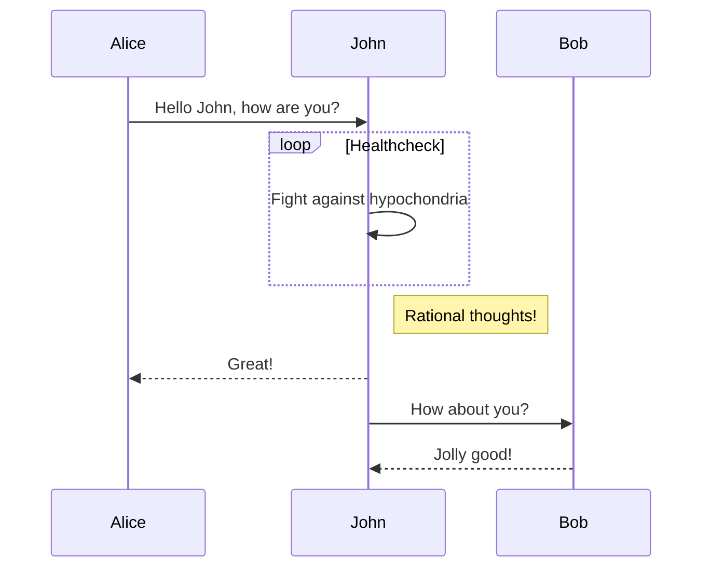

# ABRMonitoring

## Prerequisites
- Install Docker.
- Install Docker Compose.
- Machine where will be deploy needs access to internet.

## Workflow

### HLS manifest parse

# Sumary

The idea of this repo is create an HLS, DASH and SMOOTH streaming monitoring tool, that mean that could check HTTP status request of the manifest and chunks, analize how available they are in terms of HTTP answer and push a report in Elasticsearch.

In the future there will be a feature where all of this will be in containers, this will rock and will be easy to implement anywhere.

# License

